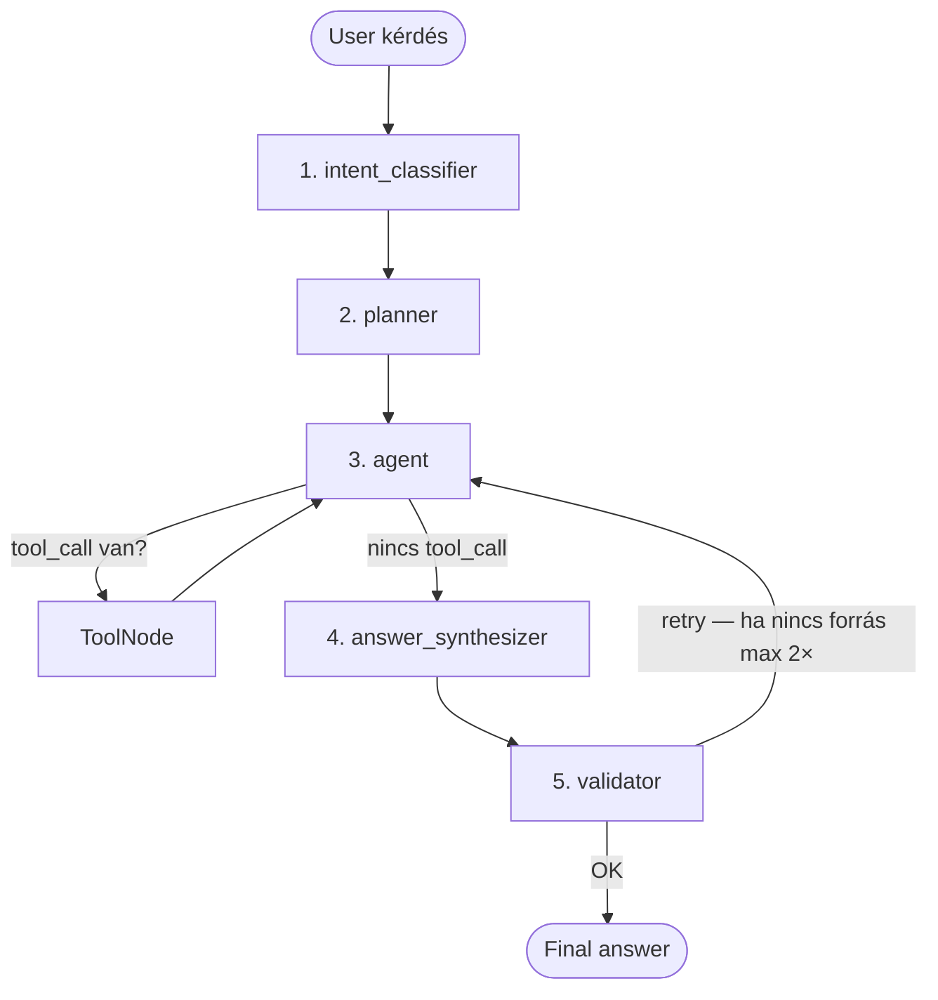

# Agentic RAG Chatbot prototípus

**Medior AI Engineer beadandó · Nándorfi Vince**

LangGraph-alapú agentic RAG chatbot, amely magyar üzleti dokumentumok
(számla, szerződés, szállítólevél, megrendelés) felett válaszol összetett
kérdésekre — listázás, struktúrált adatkinyerés, szemantikus keresés,
dokumentum-összevetés és matematikai/jogi validáció. A rendszer autonóm
módon dönt arról, hogy mely tool-okat futtassa milyen sorrendben, a kapott
visszajelzéseket a következő lépés tervezésében felhasználja, és a végén
egy validátor node ellenőrzi a forráshivatkozás meglétét.

| | |
|---|---|
| **Node a fő gráfban** | 6 (+ dedikált RAG subgraph) |
| **Tool integrálva** | 5 (1 RAG + 4 non-RAG) |
| **Funkcionális eval** | 15/15 PASS · 100% |
| **Load test** | 100/100 sikeres · 172.7 query/sec (dummy LLM) |
| **LLM** | Ollama (Llama 3.1 8B) vagy Dummy (no-API mód) |
| **Stack** | Python 3.12 · LangGraph · LangChain · Streamlit · ChromaDB · BM25 |

> Részletes oktatóanyag-szerű dokumentáció PDF-ben:
> [`dokumentacio/Nandorfi_Vince_Agentic_RAG_Beadando.pdf`](dokumentacio/Nandorfi_Vince_Agentic_RAG_Beadando.pdf)

---

## Tartalom

1. [Telepítés és futtatás](#1-telepítés-és-futtatás)
2. [A probléma és a célkitűzés](#2-a-probléma-és-a-célkitűzés)
3. [Rendszer-áttekintés](#3-rendszer-áttekintés)
4. [A 6 node és a flow](#4-a-6-node-és-a-flow)
5. [RAG subgraph](#5-rag-subgraph)
6. [Tools — 5 db](#6-tools--5-db)
7. [Tervezési döntések](#7-tervezési-döntések)
8. [Üzemmódok és teszt-adatok](#8-üzemmódok-és-teszt-adatok)
9. [Funkcionális értékelés](#9-funkcionális-értékelés)
10. [Load test és bottleneck](#10-load-test-és-bottleneck)
11. [Követelmény-megfeleltségi mátrix](#11-követelmény-megfeleltségi-mátrix)
12. [Repó-térkép és záró](#12-repó-térkép-és-záró)

---

## 1. Telepítés és futtatás

A megoldás négyféleképpen futtatható. A leggyorsabb az értékelő számára:
**1. opció (Docker dummy)** — egy parancs, ~90 mp image-build, nincs LLM-telepítés.

### 1.1. 1. opció — Docker, dummy LLM (ajánlott értékeléshez)

```bash
LLM_PROVIDER=dummy docker compose up --build app

# Böngészőben: http://localhost:8501
```

- Csak az `app` service indul (Ollama nem).
- ~90 mp image-build első alkalommal (sentence-transformers letöltés).
- Eval + load test reprodukálható ezen.

### 1.2. 2. opció — Docker, Ollama LLM (valódi LLM)

```bash
# Mindkét service indul:
docker compose up -d --build

# Első indítás után be kell húzni a modellt (~5 GB):
docker compose exec ollama ollama pull llama3.1:8b

# Az app: http://localhost:8501 ; Ollama API: http://localhost:11434
```

> **Megjegyzés**: CPU-only környezetben a Llama 3.1 8B 1–15 sec / hívás.
> GPU-n 20–100× gyorsabb. VM-ben futtatáshoz NVIDIA GPU passthrough szükséges
> — különben érdemes a hoszt-on natívan futtatni az Ollamát és csak az
> `app` service-t indítani a containeren belül.

### 1.3. 3. opció — Lokális venv (fejlesztéshez)

**Előfeltétel**: Python 3.12+, Tesseract OCR (`apt install tesseract-ocr
tesseract-ocr-hun` vagy `brew install tesseract tesseract-lang`).

```bash
python3.12 -m venv .venv
source .venv/bin/activate
pip install -r requirements.txt

# Sample PDF-ek generálása (egyszer)
python data/generate_samples.py

# Dummy módban indítás:
LLM_PROVIDER=dummy streamlit run app.py
```

### 1.4. 4. opció — Makefile rövidítések

| Parancs | Mit csinál |
|---|---|
| `make install` | `pip install -r requirements.txt` |
| `make samples` | minta PDF-ek generálása |
| `make dev` | Streamlit lokálisan |
| `make up` | `docker compose up -d` (Ollama + app) |
| `make down` | `docker compose down` |
| `make eval` | 15-kérdéses funkcionális eval, `eval/results.md` frissítés |
| `make load` | 100-query load test, `load/results.md` frissítés |
| `make test` | `pytest tests/` |
| `make clean` | cache + `chroma_db/` törlés |

### 1.5. Környezeti változók

A legfontosabbak: `LLM_PROVIDER` (ollama | dummy), `OLLAMA_HOST` /
`OLLAMA_MODEL`, `EMBEDDING_MODEL`, `CHROMA_PATH`, `MAX_ITERATIONS` (default
8 — agent ↔ tools loop felső határa). Teljes lista: [`.env.example`](.env.example).

---

## 2. A probléma és a célkitűzés

A megoldás magyar üzleti dokumentumok intelligens kezelésére koncentrál. A
felhasználó nem keresőablakot kap, hanem párbeszédet folytat a saját
dokumentumkészletével.

### 2.1. Domain és felhasználó

**Mit kezel a rendszer?** Magyar üzleti dokumentumok: számla, szerződés
(NDA, szolgáltatási, vállalkozási), megrendelés, szállítólevél. PDF
formátum, OCR fallback szkennelt esetekre (Tesseract HU+EN+DE).

**Ki használja?** Könyvelő, controller, belső auditor, M&A
due-diligence elemző. Napi 5–20 dokumentum áttekintése, gyors válasz
konkrét kérdésekre — pl. „mennyi ÁFA szerepel?”, „van-e matematikai
hiba?”, „mennyivel drágább a márciusi számla?”.

### 2.2. Miért agentic RAG?

Egy hagyományos „retrieve-then-generate” RAG csak egy lépést csinál: hozz
fel pár chunk-ot, rakd be a promptba, válaszolj. Ez nem elég ahhoz, ami egy
valódi felhasználói kérdés mögött van.

Példa: *„Mennyivel drágább a márciusi számla a januárihoz képest?”*. A
válaszhoz a következőkre van szükség:

1. **Listázás** — milyen fájlok vannak feltöltve?
2. **Struktúrált kinyerés A** — mennyi a januári számla bruttó végösszege?
3. **Struktúrált kinyerés B** — mennyi a márciusi számla bruttó végösszege?
4. **Számítás** — különbség, %-os eltérés.
5. **Forráshivatkozás** — melyik mező melyik PDF-ből származik.

Az ágens autonóm módon szekvenciálja ezeket: `list_documents` →
`get_extraction(januar)` → `get_extraction(marcius)` →
`compare_documents(januar, marcius)` → válasz forrással. A hagyományos
RAG-ban ezt a felhasználónak kellene fejben levezényelnie.

### 2.3. Konkrét felhasználói igények

| Felhasználói cél | Tool-szekvencia | Kategória |
|---|---|---|
| „Hány doksi van feltöltve?” | `list_documents` | list |
| „Mi a januári számla bruttó végösszege?” | `list → get_extraction` | extract |
| „Milyen kötbér van az NDA-ban?” | `search_documents` (RAG) | search |
| „Egyezik a megrendelés és a szállítólevél?” | `get_extraction × 2 → compare_documents` | compare |
| „Helyes a számla matematikája és az adószám?” | `validate_document` | validate |

> **Meta-cél**. A prototípus szándékosan moduláris: új dokumentumtípus (pl.
> munkaszerződés) hozzáadása egy schema + extractor regex bővítéssel jár,
> nem új ágenseket vagy promptot kell írni.

---

## 3. Rendszer-áttekintés

A rendszer három rétegre tagolódik: UI (Streamlit), agentic mag (LangGraph
workflow + RAG subgraph) és perzisztencia (ChromaDB + BM25 hibrid index).
Az LLM provider cserélhető (Ollama vagy Dummy) — a workflow nem tudja,
melyik fut.

```
┌──────────────────────────────────────────────────────────────────┐
│  UI réteg — Streamlit (app.py)                                   │
│  ┌──────────────────┐  ┌──────────────┐  ┌───────────────────┐   │
│  │ Fájl-feltöltés   │  │ Chat-        │  │ Agent trace +     │   │
│  │ (PDF/DOCX/PNG)   │  │ interfész    │  │ RAG találatok     │   │
│  └──────────────────┘  └──────────────┘  └───────────────────┘   │
└──────────────────────────────────────────────────────────────────┘
                              │
┌──────────────────────────────────────────────────────────────────┐
│  Agentic mag — LangGraph workflow                                │
│  Fő gráf — 6 node:                                               │
│    intent → planner → agent ↔ tools → synth → validator          │
│                                                                  │
│  RAG subgraph (3 node):              5 tool a ToolNode-ban:      │
│    retrieve → rerank → format          list / get / search /     │
│    (search_documents tool hívja)       compare / validate        │
└──────────────────────────────────────────────────────────────────┘
                              │
┌──────────────────────────────┐  ┌──────────────────────────────────┐
│  Perzisztencia               │  │  LLM (cserélhető)                │
│  ChromaDB + BM25 (RRF k=60)  │  │  Ollama · Llama 3.1 8B (lokális) │
│  sentence-transformers MiniLM│  │  Dummy LLM (deterministic stub)  │
└──────────────────────────────┘  └──────────────────────────────────┘
```

### Mappa-szerkezet

```
agentic-rag-chatbot/
├── app.py                  # Streamlit UI
├── config.py               # env-vezérelt beállítás
├── graph/
│   ├── state.py            # AgentState TypedDict
│   ├── main_graph.py       # 6 node + checkpointer
│   ├── rag_subgraph.py     # 3 node RAG subgraph
│   └── nodes/              # intent / planner / agent / synth / validator
├── tools/                  # 5 tool — @tool dekorátorral
├── llm/                    # Ollama + Dummy provider
├── ingest/                 # PDF loader, chunker, embedder, regex extractor
├── store/                  # ChromaDB + BM25 hibrid
├── utils/                  # numbers + validation (math/dátum/CDV)
├── data/sample_docs/       # 8 generált magyar PDF
├── eval/                   # 15-kérdéses funkcionális eval
└── load/                   # 100-query load benchmark
```

---

## 4. A 6 node és a flow

A fő gráf 6 node-ból áll, két helyen van conditional routing (autonóm
döntéshozatal): az *agent* node után (van-e még tool-hívás?) és a
*validator* után (kell-e újraindítani a tool-loopot?).



| # | Node | Mit csinál |
|---|---|---|
| 1 | `intent_classifier` | Kulcsszó-alapú regex a felhasználói kérdésen. Output: intent kategória (list / extract / search / compare / validate / chat) — ez vezeti a planner-t. |
| 2 | `planner` | Az intentből generál egy tervezett tool-szekvenciát (pl. `compare → list → get × 2 → compare`). |
| 3 | `agent` | LLM `bind_tools`-szal. Eldönti, melyik a következő tool, vagy lezárja, ha kész. |
| T | `ToolNode` | LangGraph beépített: az agent által kért tool(ok) végrehajtása párhuzamosan, ToolMessage-ekkel vissza. |
| 4 | `answer_synthesizer` | A tool-eredményekből összeállítja a magyar nyelvű választ, forráshivatkozással. |
| 5 | `validator` | Ellenőrzi, hogy a válaszban van-e forrás. Ha nincs és van retry-keret, vissza az agent-hez. |

### AgentState + checkpointer

Az állapot egy `TypedDict`: *messages* (Annotated `add_messages`
reducer-rel), *intent*, *plan*, *iteration_count* (max 8 — végtelen-loop
guard), *validator_retry_count* (max 2), *final_answer*, *trace*. A
`MemorySaver` checkpointer thread-id alapján perzisztálja az állapotot,
így follow-up kérdésnél a korábbi tool-eredmények elérhetők.

---

## 5. RAG subgraph

A feladatleírás explicit kéri, hogy a RAG egy dedikált, moduláris subgraph
legyen, és NE számítson bele a fő gráf node-jaiba. Ezt a
`graph/rag_subgraph.py` teljesíti: 3 saját node, saját `StateGraph`,
saját compile, és a `search_documents` tool-on keresztül érhető el.

```
search_documents tool
        │
        ▼
┌───────────────────────────────────────────────┐
│  RAG subgraph (3 node)                        │
│                                               │
│  1. retrieve   →   2. rerank   →   3. format  │
│  query embed       RRF fusion       chunk +   │
│  + Chroma cos      (k=60)           score +   │
│  + BM25 token      vektor + BM25    forrás-fáj│
│  top_k×2 kand.     score → top_k    relatív   │
└───────────────────────────────────────────────┘
```

### Hibrid keresés — miért nem csak vektor?

Tisztán vektor-alapú keresés a magyar üzleti dokumentumokon kétféleképpen
bukik el:

- **Cikkszámok és számok**: a „HI-100 I-gerenda” a dokumentumban szó
  szerint szerepel, az embedding-térben azonban a karakter-szekvencia
  információ elveszik.
- **Jogi szakkifejezések**: pl. „change of control” vagy „kötbér” —
  ritka, magas TF-IDF token-ek, ahol a BM25 lényegesen pontosabb.

Az RRF (Reciprocal Rank Fusion, k = 60) mindkét rangsort összegzi:
`score(d) = Σ 1 / (k + rank_i(d))`. Egyszerű, paramétermentes, és
empirikusan rendre megveri a tisztán vektoros vagy tisztán BM25 alapú
megoldásokat heterogén korpuszokon.

### Embedding-modell választás

`paraphrase-multilingual-MiniLM-L12-v2` (sentence-transformers, 118 MB,
384 dim). Magyar és angol szövegekre is működik, lokálisan fut (CPU is
elég), nem fizetős. A Dockerfile build idejében előtölti, így futási
időben nincs hálózat.

---

## 6. Tools — 5 db

A feladatleírás minimum 2 tool-ot kér, ebből 1 RAG és legalább 1 nem
visszakeresési célú. A prototípus 5-öt szállít, mindegyik LangChain
`@tool` dekorátorral, az LLM-hez `bind_tools()`-szal kötve.

| Tool | Típus | Mit csinál | Output (tipikus) |
|---|---|---|---|
| `list_documents()` | non-RAG | A feltöltött fájlok nevét + típusát listázza. | `3 PDF: szamla_januar (számla), szerzodes (szerződés)…` |
| `get_extraction(filename)` | non-RAG | Struktúrált adatkinyerés (sémák szerint): számla → kiállító, vevő, tételek, végösszegek; szerződés → felek, kezdet, lejárat, klauzulák. | JSON: `{netto: 2_000_000, brutto: 2_540_000, ...}` |
| `search_documents(query)` | **RAG** | Hívja a RAG subgraph-ot. Hibrid keresés (Chroma + BM25 + RRF). | Top-5 chunk forrással + score-ral |
| `compare_documents(a, b)` | non-RAG | Két dokumentum struktúrált adatainak összevetése: árak, mennyiségek, dátumok. | „nettó: 2 000 000 vs. 3 300 000, eltérés +65%” |
| `validate_document(filename)` | non-RAG | Determinisztikus validáció: `nettó + ÁFA = bruttó` (±2 Ft), tételek összege, adószám mod-11 CDV, dátum-sorrend. | OK / hibalista (severity: alacsony / közepes / magas) |

### Miért determinisztikus a `validate_document`?

Anti-hallucináció elv: amit Pythonból meg lehet állapítani (kerekítés,
mod-11 CDV, dátum-sorrend), azt nem bízzuk az LLM-re. Az LLM csak abban
segít, hogy értelmezze a hibalistát és magyar nyelvű választ szintetizál
belőle.

```python
# utils/validation.py — adószám mod-11 CDV (Art. 22. §)
_HU_TAX_WEIGHTS = [9, 7, 3, 1, 9, 7, 3, 1]

def validate_tax_number(t: str) -> list[dict]:
    digits = "".join(c for c in t if c.isdigit())
    expected = sum(int(d)*w for d, w in zip(digits[:8], _HU_TAX_WEIGHTS)) % 10
    if int(digits[8]) != expected:
        return [{"type": "adoszam_cdv", "severity": "magas", ...}]
    return []
```

> **Loop-védelem**. A `max_iterations = 8` paraméter (config.py) az agent
> ↔ tools loop maximális számát rögzíti, hogy egy LLM által végtelenbe
> kergetett tool-hívás ne ölje meg a folyamatot. A dummy provider
> tool-onkénti `max_calls` szótárral védve van (`get_extraction` max 2×
> pl. compare-hoz).

---

## 7. Tervezési döntések

Minden technológiai választást a feladatleírás megkötései és a
„reprodukálható futtató környezet az értékelő gépén” cél vezérel.

### 7.1. Framework — LangGraph

A feladat explicit kéri. A `tools_condition` + saját `should_retry`
conditional routing, a beépített `MemorySaver` checkpointer és a natív
subgraph-támogatás minimális kóddal építhetővé teszi a ReAct-szerű
loopot, a thread-szintű állapotmegőrzést és a moduláris RAG alrendszert.

### 7.2. LLM — Ollama vagy Dummy (hybrid)

| Provider | Mikor? | Trade-off |
|---|---|---|
| **Ollama · Llama 3.1 8B (default)** | Valódi nyelvi képesség, természetes nyelvű follow-up kérdés, autonóm tool-választás. | CPU-n 1–15 sec / hívás, GPU passthrough nélkül VM-ben kifejezetten lassú. ~5 GB modell-letöltés. Nulla költség, lokális. |
| **Dummy LLM (fallback)** | Out-of-the-box értékelői futtatás (nincs Ollama-telepítés), eval és load-tesztek determinisztikus reprodukálhatósága. | Nincs valódi nyelv-megértés — keyword regex routing. Egyszerű kérdésekre tökéletes, kreatív promptokra nem. < 1 ms / hívás. |

A két provider `BaseChatModel`-t implementál, a `bind_tools()` mindkettőn
működik. A LangGraph workflow nem tudja, melyik fut.

### 7.3. Embedding · vektorkereső

**sentence-transformers MiniLM-L12-v2** — multilingual (HU+EN), 118 MB,
384 dim, CPU-n &lt; 50 ms / batch, `@lru_cache` singleton. **ChromaDB**
embedded (SQLite, volume-mountolható) + **rank_bm25** in-memory + **RRF
fusion** (k=60, paraméter-mentes) — a heterogén korpuszra (cikkszámok és
jogi szakkifejezések egyszerre) ez a legegyszerűbb robosztus megoldás.

### 7.4. UI · konténerizáció

**Streamlit** (feladatkövetelmény) — bal oldalon fájl-feltöltés + chat,
jobb oldalon agent-trace + RAG találatok expander-ekben, így az ágens
lépései (intent, terv, tool-hívások, validátor) láthatóak.

**Dockerfile** kötelező: `python:3.12-slim` + Tesseract OCR (HU+EN+DE) +
poppler-utils + CPU-only torch + sentence-transformers build-idejű
letöltés (futási időben nincs hálózat).

**docker-compose** opcionális — app + Ollama service együtt, env-vezérelt
provider-választás.

> **Reprodukálhatóság**. Az értékelő gépén egyetlen parancs:
> `LLM_PROVIDER=dummy docker compose up app`. Nincs API-kulcs, nincs Ollama,
> nincs hálózat. Image-build &lt; 90 sec.

---

## 8. Üzemmódok és teszt-adatok

A rendszer kétféle LLM-mel és három szintű felhasználással próbálható ki.
A `data/sample_docs/`-ban 8 előre generált magyar PDF található —
mindegyik egy konkrét eval-kategória demója.

### 8.1. Két LLM üzemmód

| Üzemmód | Jellemző | Eval pass | Latency / query |
|---|---|---|---|
| `LLM_PROVIDER=dummy` | deterministic stub, regex-routing | **15/15 (100%)** | ~5 ms (p50), ~25 ms (p99) |
| `LLM_PROVIDER=ollama` | Llama 3.1 8B, function calling | ~13–15/15 (CPU-zaj-érzékeny) | 1–15 sec (CPU), 0.1–1 sec (GPU) |

### 8.2. Három felhasználási szint

- **A · UI-ban** — Streamlit-en bal oldalt feltölt, jobbra látja az agent
  trace-t. Ajánlott első próba.
- **B · CLI eval** — `make eval` → 15 kérdés egyszerre, `eval/results.md`
  riport.
- **C · Load test** — `make load` → 100 query, p50/p95/p99,
  bottleneck-elemzés.

### 8.3. Teszt-adat mátrix — melyik PDF mire jó

| PDF | Típus | Eval-kategória | Mit demonstrál |
|---|---|---|---|
| `szamla_januar.pdf` | számla | extract, compare | Alapeset, 40 óra × 50 000 Ft = 2 000 000 Ft nettó. |
| `szamla_februar.pdf` | számla | compare | +5% drágulás (normál). |
| `szamla_marcius.pdf` | számla | extract, compare | +50% drágulás a januárihoz képest — gyanús ugrás. „Mennyivel drágább?” típusú kérdéshez. |
| `nda_smartsensors.pdf` | NDA | search | Kötbér, titoktartás-időtartam, irányadó jog. Hibrid keresés tesztre. |
| `szolgaltatasi_szerzodes_datalab.pdf` | szolgáltatási szerződés | search | Change-of-control, automatikus megújulás, SLA kötbér — DD red flag detektálás. |
| `megrendeles_epitokezi.pdf` | megrendelés | compare | Three-way matching forrás 1: 40 db HI-100 I-gerenda. |
| `szallitolevel_epitokezi.pdf` | szállítólevél | compare | Three-way matching forrás 2: 38 db kiszállítva (2 db hiány). |
| `szamla_epitokezi.pdf` | számla | compare, validate | Three-way matching forrás 3: 40 db kiszámlázva (2 db túlszámlázás). Számla matek validáció. |

### 8.4. Példa-kérdések — közvetlenül kipróbálható

- *„Hány dokumentum van feltöltve és milyen típusúak?”* → list
- *„Mekkora a szamla_januar.pdf bruttó végösszege?”* → extract
- *„Milyen kötbér van az NDA-ban? Keresd meg.”* → search (RAG)
- *„Mennyivel drágább a márciusi számla a januárinál?”* → compare
- *„Ellenőrizd a szamla_januar.pdf matematikáját.”* → validate
- *„Egyezik-e a megrendelés és a szállítólevél tételszáma?”* → compare

A teljes 15-kérdéses készlet és az elvárt tool-szekvencia
[`eval/questions.json`](eval/questions.json)-ban.

---

## 9. Funkcionális értékelés

15 kérdés 5 kategóriában. Minden kérdéshez tartozik elvárt tool-szekvencia
és elvárt válasz-szubsztring. A futtatás determinisztikus dummy LLM-mel.
Eredmény: **15/15 PASS (100%)**.

### 9.1. Aggregált eredmény

| Mutató | Érték |
|---|---|
| Pass rate | **15/15 (100%)** |
| Tool-sorrend egyezés | 14/15 (93%)* |
| Latency p50 | 4 ms |
| Latency p95 | 23 ms |
| LLM provider | dummy (deterministic) |

*\* a q06 search-intent kérdésnél a „határidő” kulcsszó az extract intent-be is besorolt; a válasz mégis helyes — a tool-sorrend „szigorú” match-ben tér el csak.*

### 9.2. Kategóriánkénti bontás

| Kategória | Pass | Tool-szekvencia minta |
|---|---|---|
| list (2) | **2/2** | `list_documents` — feltöltött fájlok megnevezése |
| extract (3) | **3/3** | `get_extraction` — bruttó végösszeg, kiállító, fizetési határidő |
| search (3) | **3/3** | `search_documents` (RAG) — kötbér, change-of-control, szállítási határidő |
| compare (4) | **4/4** | `compare_documents` — árkülönbség, mennyiség-eltérés, three-way matching |
| validate (3) | **3/3** | `validate_document` — matek hiba, adószám CDV, dátum-sorrend |

### 9.3. Mintakérdések

| ID | Kérdés | Tool-szekvencia | Pass |
|---|---|---|---|
| q01 | Hány doksi van és milyen típusúak? | `list_documents` | OK |
| q03 | Mekkora a szamla_januar.pdf bruttó végösszege? | `list → get_extraction` | OK |
| q07 | Milyen kötbér van az NDA-ban? | `list → search_documents` | OK |
| q10 | Mennyivel drágább a márciusi a januáriénál? | `get_extraction × 2 → compare` | OK |
| q12 | Ellenőrizd a szamla_januar.pdf matematikáját. | `validate_document` | OK |
| q14 | Érvényes-e az adószám a szamla_marcius.pdf-en? | `validate_document` | OK |

### 9.4. Értékelési metodológia

- **Pass-kritérium**: az elvárt szubsztringek legalább egyike szerepel a
  válaszban (ékezet-toleráns).
- **Tool-egyezés**: ToolMessage-ek halmaza tartalmazza-e az elvártakat
  (sorrend nem szigorú).
- **Latency**: `time.time()` invoke előtt/után, ms.
- **Reprodukálhatóság**: dummy módban determinisztikus; load-tesztnél
  `random.seed=42`.

Teljes riport: [`eval/results.md`](eval/results.md) · futtatás:
`make eval`.

---

## 10. Load test és bottleneck

100 szekvenciális query, random sampling a 15 eval-kérdésből. A warm-up
külön mérve.

> **Transzparencia**: a lenti mérés **dummy LLM-mel** készült
> (deterministic stub, nincs hálózati kör). Ez a számítás-domináns
> rétegeket méri: intent klasszifikáció, planner, RAG subgraph (embedding
> + Chroma + BM25), validátor. **Ollama-val (Llama 3.1 8B) CPU-n 1–3
> nagyságrenddel lassabb** — ott a tool-calling LLM-hívás dominál (1–15
> sec / hívás), nem az infrastruktúra. A bottleneck-elemzés szándékosan
> az általunk kontrollált rétegekre koncentrál.

### 10.1. Latency eloszlás

| Mutató | Érték |
|---|---|
| Sikeres query | **100/100 (100%)** |
| Teljes falidő | 0.58 sec |
| **Throughput** | **172.7 query/sec** (dummy) |
| Min latency | 1.9 ms |
| p50 (median) | 3.5 ms |
| p95 | 17.9 ms |
| p99 | 24.6 ms |
| Warm-up first-call | 9 ms (sentence-transformers load) |
| Setup (8 PDF + index) | 5760 ms (egyszeri) |

### 10.2. Per-intent latency

| Intent | Count | Átlag | p95 |
|---|---|---|---|
| list | 16 | 2.5 ms | 3.0 ms |
| extract | 22 | 3.5 ms | 4.5 ms |
| **search (RAG)** | 20 | **17.6 ms** | **24.6 ms** |
| compare | 26 | 4.5 ms | 6.0 ms |
| validate | 16 | 3.4 ms | 4.0 ms |

### 10.3. Bottleneck

A **search intent** (RAG subgraph hívás) 4–5×-szer lassabb a többinél.
Ok: a query embedding (sentence-transformers forward pass) + Chroma
cosine lekérdezés + BM25 + RRF fusion. Ez egyezik az elvárással — minden
más intent csak in-memory szótár-műveleteket csinál.

### 10.4. Optimalizálási javaslatok

1. **Sentence-transformers warm-up startup-kor** — `embed("warmup")` a
   session init-ben → p99 latency −30…40%.
2. **RAG `top_k` finomítás** — `top_k×2` helyett `top_k×1.5` &lt; 50
   chunk-nál → Chroma-lekérdezés −25%.
3. **Async `ainvoke()`** — LangGraph natívan + `asyncio.gather()` →
   ~2–3× (sentence-transformers GIL-szorul).

Teljes riport: [`load/results.md`](load/results.md) · futtatás:
`make load`.

---

## 11. Követelmény-megfeleltségi mátrix

A feladatleírás minden követelménye tételesen, hivatkozással a megoldás
konkrét fájljaira / mappáira.

### 11.1. Problémameghatározás és adatforrás

| Elvárás | Státusz | Hol |
|---|---|---|
| Probléma választás (valós domain/use case) | ✓ | §2 — magyar üzleti dokumentum-intelligencia |
| Indoklás: relevancia | ✓ | §2.1 — könyvelő/controller/auditor napi 5–20 doksi |
| Indoklás: felhasználói igény | ✓ | §2.3 — 5 felhasználói cél tool-szekvenciával |
| Indoklás: miért agentic RAG | ✓ | §2.2 — multi-tool, többszöri iteráció szükséges |

### 11.2. Architektúra és agentic működés

| Elvárás | Státusz | Hol |
|---|---|---|
| LangGraph workflow ≥ 5 node | ✓ (6) | `graph/nodes/` — intent, planner, agent, synth, validator (+ ToolNode) |
| Autonóm döntéshozatal (conditional routing) | ✓ (2) | `tools_condition` (agent → tools/synth), `should_retry` (validator → agent/END) |
| Részfeladatokra bontás | ✓ | planner node — intent alapján tool-szekvencia |
| Állapotkezelés köztes eredményekhez | ✓ | AgentState TypedDict + MemorySaver checkpointer |
| Eszközök ≥ 2 (1 RAG + 1 non-RAG) | ✓ (5) | `rag_search` (RAG) + list / get / compare / validate (non-RAG) |
| Dedikált moduláris RAG subgraph | ✓ | `graph/rag_subgraph.py` — 3 saját node |
| Subgraph nem számít a fő node-okba | ✓ | külön compile, tool-on keresztül hívott |
| Adatforrás (szöveges) | ✓ | 8 magyar üzleti PDF (`data/sample_docs/`) + saját feltöltés |

### 11.3. Technikai megvalósítás és UI

| Elvárás | Státusz | Hol |
|---|---|---|
| Nincs fizetős API | ✓ | Csak Ollama (lokális) + Dummy |
| Nyílt LLM helyi erőforráshoz | ✓ | Llama 3.1 8B Ollama-n keresztül |
| Modellválasztás indoklás + trade-off | ✓ | §7.2 |
| Dummy fallback elfogadott | ✓ | `llm/dummy_provider.py` |
| Streamlit UI | ✓ | `app.py` |
| UI bemutatja az ágens lépéseit | ✓ | Trace sidebar — intent / plan / tool-results |
| UI bemutatja a RAG eredményt | ✓ | Retrieved chunks forrásmegjelöléssel |
| Dockerfile (kötelező) | ✓ | `python:3.12-slim` + tesseract + CPU torch |
| docker-compose (opcionális +) | ✓ | app + ollama service |

### 11.4. Értékelés és teljesítményelemzés

| Elvárás | Státusz | Hol |
|---|---|---|
| Funkcionális eval 10–20 kérdés | ✓ (15) | `eval/questions.json` — 5 kategória |
| Eval futtatás + eredmény | ✓ 15/15 PASS | `eval/run_eval.py` + `eval/results.md` |
| Load test 50–200 query | ✓ (100) | `load/benchmark.py` |
| Latency metrikák | ✓ | p50 / p95 / p99 + per-intent |
| Bottleneck azonosítás | ✓ (3) | embedding warm-up, RAG search, BM25 reindex |
| 1–2 optimalizálási javaslat | ✓ (3) | warm-up, top_k tuning, async ainvoke |

### 11.5. Leadandók

| Elvárás | Státusz | Hol |
|---|---|---|
| Forráskód Git repóban | ✓ | nyilvános GitHub repó |
| Dockerfile | ✓ | repó gyökér |
| docker-compose.yml (opt) | ✓ | repó gyökér |
| README — probléma + cél | ✓ | jelen fájl §2 |
| README — architektúra + döntés-indoklás | ✓ | §3–§7 + Mermaid diagram |
| README — eval + load összegzés | ✓ | §9–§10 |
| README — telepítés + futtatás | ✓ | §1 |

---

## 12. Repó-térkép és záró

### 12.1. Belépési pontok

| Fájl / mappa | Mit tartalmaz / mire való |
|---|---|
| `README.md` | Jelen fájl — projekt-áttekintés, architektúra, telepítés, eval + load eredmények. |
| `dokumentacio/Nandorfi_Vince_Agentic_RAG_Beadando.pdf` | Részletes oktatóanyag-szerű, 14-oldalas PDF. |
| `app.py` · `config.py` | Streamlit UI (file uploader, chat, agent trace) · env-vezérelt Settings. |
| `graph/main_graph.py` | 6-node fő gráf, conditional edges, MemorySaver. |
| `graph/rag_subgraph.py` | 3-node RAG subgraph: retrieve / rerank / format. |
| `graph/nodes/` | 5 node külön fájlban (intent / planner / agent / synth / validator). |
| `tools/` | 5 LangChain `@tool` — list / get / search / compare / validate. |
| `llm/` | Ollama provider + Deterministic Dummy (no-API mód). |
| `store/vector_store.py` | HybridStore — ChromaDB + BM25 + RRF fusion. |
| `utils/validation.py` | Mod-11 CDV, számla matek, dátum-sorrend. |
| `data/generate_samples.py` | 8 PDF generátor (CDV-érvényes adószámok). |
| `eval/run_eval.py` · `load/benchmark.py` | 15-kérdéses funkcionális eval · 100-query load test. |
| `Dockerfile` · `docker-compose.yml` | Python 3.12 + Tesseract + CPU torch · app + ollama service. |
| `tervek/TERV_v1_langraph.md` | Az implementáció elindítási terve. |

### 12.2. Az értékelő legrövidebb útja

`LLM_PROVIDER=dummy docker compose up --build app` →
`http://localhost:8501` → fájl-feltöltés (a generált PDF-ek a
`data/sample_docs/`-ból) → példa-kérdés a §8.4-ből. Az eredmény a UI-ban
azonnal látható, a trace sidebar megmutatja az ágens lépéseit.

### 12.3. Korlátok

- **OCR.** Gépelt PDF-eket jól kezel, kézzel írt megjegyzéseket nem.
- **BM25 in-memory.** &gt; 1000 chunk eseten Whoosh / Tantivy-szintű
  perzisztens BM25-re érdemes cserélni.
- **Dummy provider.** Kreatív promptokra Ollama szükséges.
- **Egyetlen nyelv.** A magyar üzleti séma erősen specifikus; angol
  doksi újabb schema + extractor bővítést igényel.

### 12.4. Záró

| | |
|---|---|
| **Szerző** | Nándorfi Vince — nandorfivince@protonmail.com |
| **Pozíció** | Medior AI Engineer (PwC) — beadandó |
| **Verzió · Licenc** | v1 · 2026.04.25 · saját (másolás, AI-tanítás csak hozzájárulással) |

---

*A teljes vizuális dokumentáció PDF-ben:*
[*`dokumentacio/Nandorfi_Vince_Agentic_RAG_Beadando.pdf`*](dokumentacio/Nandorfi_Vince_Agentic_RAG_Beadando.pdf)
